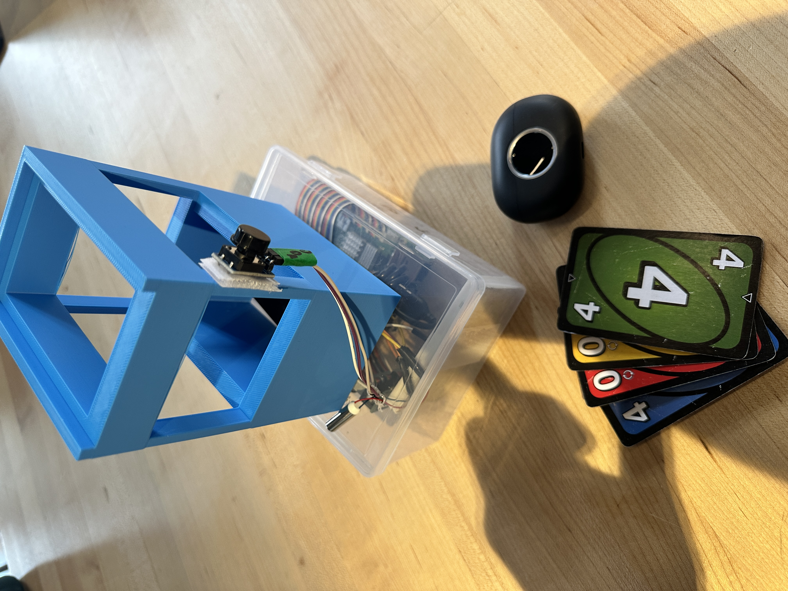
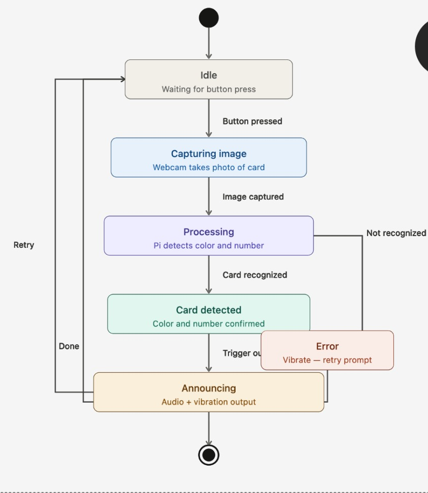
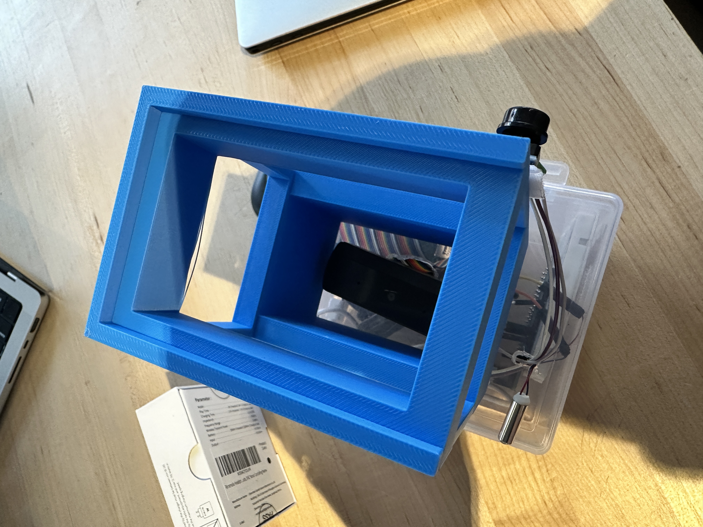
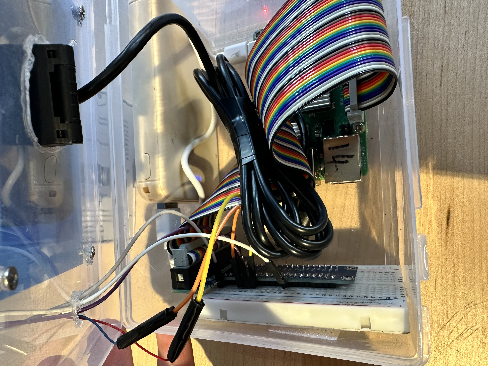
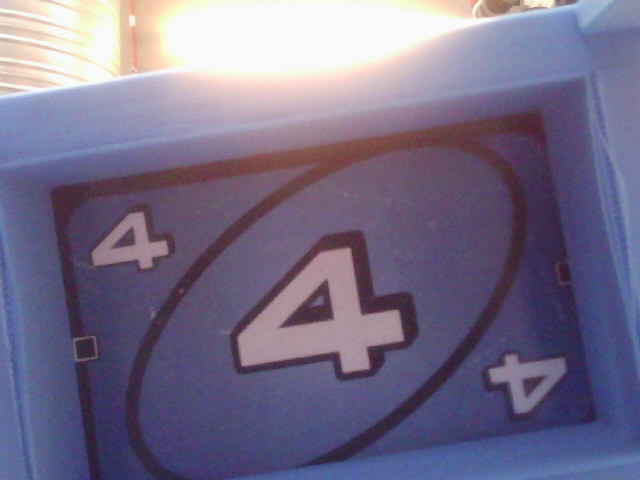

# BUNO (Blind UNO) — Assistive Gaming Device

> **An accessible Raspberry Pi & Computer Vision system enabling visually impaired individuals to play UNO independently through real-time card recognition, state tracking, and audio/haptic feedback.**

<p align="center">
  
</p>

---

## 📌 Project Overview

**BUNO** bridges the accessibility gap in tabletop card games. By combining custom 3D-printed hardware, computer vision processing, and dual-button state logic, BUNO reads and tracks cards for visually impaired players without compromising game privacy or requiring third-party assistance.

### Key Features
* 📷 **Fixed Optical Scanning Box:** Custom enclosure provides consistent camera focus, framing, and light isolation.
* 🧠 **Real-Time Color & Symbol CV:** Preprocesses frames (HSV color masking, filtering) to detect colors (Red, Blue, Yellow, Green) and card numbers/actions.
* 🎧 **Private Audio Feedback:** Reads card identities directly to the user via Bluetooth/3.5mm audio.
* 📳 **Haptic Feedback:** Vibrates via a tactile motor to confirm successful actions or prompt retries.
* 🧠 **Smart Hand Inventory Tracking:** Maintains an active list of cards currently held in the user's hand.

---

## 🔄 System Logic & Workflow

The core state machine handles scanning, card verification, and inventory management using dual-button interaction.

<p align="center">
  
</p>

### User Interaction Model
* **Button A (Action / Scan):**
  * **Single Click:** Scans a new card to add to the player's active hand or updates table status.
  * **Double Click:** Confirms playing a card from the hand, removing it from the stored inventory.
* **Button B (Status Check):**
  * **Single Click:** Reads out the current cards held in hand (e.g., *"You have 4 cards: Red 3, Blue Skip, Yellow 2, and Wild"*).

---

## 🛠️ Hardware Setup & Electronics

The hardware consists of a top scanning enclosure resting on an electronics housing base containing the Raspberry Pi, power source, and breadboard.

<div align="center">

| Top View (Card Slot) | Internal Electronics & Wiring | Complete Assembly |
| :---: | :---: | :---: |
|  |  |  |

</div>

### Enclosure Iterations (Autodesk Fusion 360)
The chassis evolved through physical testing to optimize ambient light entry and ease of card insertion.

---

## Functional Specifications

* **Overall Scan Accuracy:** ~92% across all tested card types.
* **Number Cards (0–9):** ~95% accuracy under standard lighting.
* **Color Detection:** ~98% accuracy across all color variants.
* **Action Cards (Skip, Reverse, Wild, Draw Two):** ~89% accuracy.
* **Average Response Time:** ~1.2 seconds from button press to voice output.
* **Camera Capture Resolution:** 640×480 pixels using standard USB video capture (`fswebcam`).
* **Core Microcontroller:** Raspberry Pi running Linux OS.
* **AI Processing Engine:** OpenAI GPT Vision API (`gpt-5-nano-2025-08-07`) integrated with OpenCV frame handling.
* **Audio Feedback:** Private voice feedback via 3.5mm audio jack or paired Bluetooth earphones using `espeak` Text-to-Speech engine.
* **Haptic Feedback:** DC Vibration Motor driven via GPIO Pin 13 through an NPN transistor circuit.
* **User Input:** Tactile push button configured on GPIO Pin 11 with internal pull-up resistor (`GPIO.PUD_UP`).
* **Enclosure:** Custom two-part 3D-printed structure (transparent lower housing box for electronics, top blue alignment tower for optimal camera focal length).

---

## Core Features

* **Instant AI-Powered Recognition:** Captures and identifies standard unmodified UNO cards (both colors and numbers/actions) without needing special decks or Braille modifications.
* **Dual Feedback System:** Combines private audio output through earphones with physical haptic vibrations to confirm system actions.
* **Physical Alignment Tower:** A 3D-printed card slot holds cards at the exact distance and angle required for accurate camera detection.
* **Single-Button Simplicity:** Designed specifically for accessibility; the user only needs to interact with one tactile button to operate the scanner.
* **Inclusive Gameplay:** Enables visually impaired players to participate independently and fairly alongside sighted players.

---

## Components Used

### Hardware Components

| Component | Function / Usage | Reference / Connection |
| :--- | :--- | :--- |
| **Raspberry Pi** | Main single-board computer / system controller | Central Processing Unit |
| **USB Webcam** | Top-down camera module for card image capture | Connected via USB |
| **Tactile Push Button** | Physical user input trigger | GPIO Pin 11 (Pull-up resistor) |
| **DC Vibration Motor** | Haptic confirmation feedback | GPIO Pin 13 (via Transistor driver) |
| **Earphones / Headphones** | Audio announcement output | 3.5mm Audio Jack / Bluetooth |
| **3D-Printed Alignment Frame** | Structural tower for positioning cards | Custom CAD design in Fusion |
| **Transparent Enclosure Box** | Encloses breadboard, Pi, power unit, and wiring | Main base box |
| **Power Bank / Battery** | Portable power source | USB Micro / Type-C Power Input |

### Software & Libraries

* **Python 3:** Core programming language.
* **OpenAI Python API:** Vision inference using the `gpt-5-nano-2025-08-07` model.
* **RPi.GPIO:** Hardware pin control for button inputs and haptic motor execution.
* **fswebcam:** Command-line camera utility for frame capture.
* **espeak / pyttsx3:** Text-to-Speech (TTS) synthesis for voice prompts.
* **OpenCV:** Local frame handling and image preprocessing.

---

## Theory of Operation

<div align="center">

```text
+-------------------------------------------------------------+
|                        Idle State                           |
|            (Monitoring GPIO Pin 11 for Button Press)        |
+------------------------------+------------------------------+
                               |
                               v Button Pressed
+-------------------------------------------------------------+
|                   Start Scan Notification                   |
|            (Pulse Vibration Motor on GPIO 13 for 0.2s)      |
+------------------------------+------------------------------+
                               |
                               v
+-------------------------------------------------------------+
|                      Image Capture                          |
|         (fswebcam captures 640x480 frame down top tower)     |
+------------------------------+------------------------------+
                               |
                               v
+-------------------------------------------------------------+
|                 Encoding & Vision Inference                 |
|     (Convert image to Base64 -> OpenAI gpt-5-nano API)      |
+------------------------------+------------------------------+
                               |
                               v
+-------------------------------------------------------------+
|                     Output Synthesis                        |
|   1. Audio TTS via espeak: Speaks result (e.g. "Green 4")    |
|   2. Double Haptic Pulse (2x 0.1s buzzes) on GPIO Pin 13    |
+------------------------------+------------------------------+
                               |
                               v
+-------------------------------------------------------------+
|                     Return to Idle                          |
+-------------------------------------------------------------+


1. **System Initialization:** The script configures GPIO mode, sets Pin 13 (Motor) as output, and Pin 11 (Button) as an input with an internal pull-up resistor.
2. **Event Polling:** The main loop continuously checks Pin 11. When pressed (voltage drops to LOW), the scan routine activates.
3. **Haptic Acknowledgement:** Pin 13 fires HIGH for 0.2 seconds to give immediate physical confirmation that the button press was detected.
4. **Frame Capture:** The system invokes `fswebcam` to capture a 640×480 frame (`captured_image.jpg`) from the top-down USB camera.
5. **Vision Processing:** The image is converted to a base64 Data URL and sent in a request payload to the OpenAI vision API. The model evaluates the card details and returns a string identifying color and value (e.g., `"Green 4"`).
6. **Audio & Completion Signal:** The result string is passed to `espeak` to broadcast through the earphones. Simultaneously, the vibration motor pulses twice in rapid succession (0.1s each) to confirm successful completion before returning to idle.

---

## Product Operating Instructions

1. **Power Setup:**
   * Connect the portable power bank to the Raspberry Pi.
   * Plug your earphones into the 3.5mm audio jack or verify Bluetooth pairing.

2. **Placing a Card:**
   * Take the card you wish to read and slide it face up into the top blue 3D-printed tower frame.

3. **Initiating the Scan:**
   * Press the tactile push button located on the side of the device.
   * You will feel a single short vibration pulse, confirming the system has begun reading the card.

4. **Reading the Result:**
   * Within ~1–2 seconds, listen to your earphones to hear the announced card color and number/type (e.g., *"Red 8"*, *"Blue Skip"*, or *"Wild"*).
   * A double vibration pulse will follow to confirm the scan completed successfully.

5. **Continuing Play:**
   * Remove the card from the top tower and proceed with your turn.
## 📷 Computer Vision & Sample Captures

The internal camera captures high-contrast, framed views of the card face when inserted into the slot.

<div align="center">
<table width="100%">
  <tr>
    <td align="center" width="33.33%"><b>Blue 4 Card</b></td>
    <td align="center" width="33.33%"><b>Yellow 0 Card</b></td>
    <td align="center" width="33.33%"><b>Red 0 Card</b></td>
  </tr>
  <tr>
    <td align="center"></td>
    <td align="center"></td>
    <td align="center"></td>
  </tr>
  <tr>
    <td align="center"><i>Captured Frame (Blue 4)</i></td>
    <td align="center"><i>Captured Frame (Yellow 0)</i></td>
    <td align="center"><i>Captured Frame (Red 0)</i></td>
  </tr>
</table>
</div>

---

## 💻 Tech Stack & Dependencies

* **Hardware:** Raspberry Pi, USB Webcam Module, Vibration Motor, Push Buttons, Power Bank.
* **Languages & Frameworks:** Python 3, OpenCV (Computer Vision), `RPi.GPIO` (Hardware Interface), `pyttsx3` (Text-to-Speech).
* **CAD Software:** Autodesk Fusion 360.
